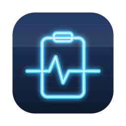

<p align="center">
  
</p>

<h1 align="center">DeskPulse</h1>

<p align="center"><b>Free, open-source clipboard manager, text expander, and PDF + image toolbox for Mac in one native app. Merge, split, compress, watermark, protect, and OCR PDFs. PDF to Word, HEIC to JPG, resize, compress, crop, and remove image backgrounds. Everything the PDF and image websites do, without uploading your files - zero network access.</b></p>

<p align="center">
  
  
  
  
</p>

## What is DeskPulse?

DeskPulse is a free alternative to Paste, TextExpander, Permute, and the iLovePDF / iLoveIMG web tools. It bundles the desk utilities people usually pay for or upload files to websites for: clipboard history, text snippets, a document and file converter, a full PDF toolbox (merge, split, compress, watermark, protect, OCR), and image tools including background removal. The app is under 3 MB, there is no telemetry, and nothing ever touches the network.

## Features

| Tool | What it does |
|---|---|
| **Clipboard History** | Every copy is captured: text, images, and files. Search it, pin favorites so they never expire, click to copy back, or copy as plain text to strip formatting. Anything a password manager marks confidential is never recorded. |
| **Text Snippets** | Type `;addr` anywhere and it becomes your full address. Triggers expand in every app, with `{date}`, `{time}`, and `{clipboard}` placeholders filled at expansion time. |
| **File Converter** | Images: HEIC, PNG, JPG, TIFF, WebP, GIF, BMP between each other or to PDF, with quality and resize controls, plus combine several images into one PDF. Audio: MP3 sources to M4A, WAV, AIFF, or FLAC. Documents: DOCX, DOC, RTF, TXT, HTML, ODT, and Markdown between each other or to PDF. PDFs: to Word, RTF, TXT, HTML, or page images. Originals are always kept and existing files are never overwritten. |
| **PDF Tools** | Merge PDFs, split by page or range, reorder/rotate/delete pages in a visual editor, compress, watermark, add page numbers, password protect and unlock, and OCR: scanned PDFs and photos to text, Word, or a searchable PDF with an invisible text layer. |
| **Image Tools** | Resize by pixels or percent, compress for email and uploads (JPEG or HEIC, shows how much smaller the result is), crop with aspect presets, text and logo watermarks, 2x-4x enlargement, remove backgrounds (macOS 14+), rotate and flip. All batch, all local. |
| **Menu bar popover** | Your last eight clips one click away, next to the clock. DeskPulse keeps working when the window is closed. |

Conversion runs on the `sips`, `afconvert`, and `textutil` tools plus the PDFKit framework that ship inside macOS, so DeskPulse adds no codecs, no bundled ffmpeg or LibreOffice, and no dependencies. One honest limit: document conversion carries text and formatting, not embedded images or exact page layout. For pixel-perfect fidelity on complex documents you still want the original app.

## DeskPulse vs the paid apps

| | DeskPulse | Paste | TextExpander | Permute | Maccy |
|---|---|---|---|---|---|
| Price | Free | $30/yr | $40/yr | $15 | Free |
| Open source | Yes | No | No | No | Yes |
| Clipboard history + search | Yes | Yes | No | No | Yes |
| Pinned favorites | Yes | Yes | No | No | Yes |
| Image and file clips | Yes | Yes | No | No | Partial |
| Text expansion snippets | Yes | No | Yes | No | No |
| Image conversion (HEIC to JPG) | Yes | No | No | Yes | No |
| Image resize and compression | Yes | No | No | Yes | No |
| Document conversion (PDF to Word, DOCX to PDF) | Yes | No | No | No | No |
| Audio conversion | Yes | No | No | Yes | No |
| Video conversion | No | No | No | Yes | No |
| iCloud sync across devices | No | Yes | Yes | No | No |
| Telemetry / network calls | None | Yes | Yes | Some | None |

Each of those apps is good at its single job, and the sync features are real advantages if you live on multiple devices. DeskPulse exists because most people need 80% of all three, on one Mac, without three subscriptions.

## DeskPulse vs the PDF and image websites

| | DeskPulse | iLovePDF | iLoveIMG | Smallpdf |
|---|---|---|---|---|
| Price | Free | Free tier + $7/mo | Free tier + $7/mo | $12/mo |
| Files stay on your Mac | Yes | Uploaded to their servers | Uploaded | Uploaded |
| Works offline | Yes | No | No | No |
| Account required | Never | For most features | For most features | Yes |
| File size / task limits | None | On free tier | On free tier | On free tier |
| Open source | Yes | No | No | No |

The web tools are convenient and cover a few things DeskPulse does not (e-signing, PDF repair, layout-perfect PDF to Word on complex documents, AI upscaling). For everything else, DeskPulse does the same job on your own machine: nothing to upload, no queue, no size limits, and it works on a plane.

## Install

Build from source (needs Xcode Command Line Tools: `xcode-select --install`):

```sh
git clone https://github.com/panwardev687/deskpulse.git
cd deskpulse
./build.sh
open DeskPulse.app
```

The build is a single `swiftc` invocation and takes a few seconds. No Xcode project, no package manager, no dependencies.

To start DeskPulse at login, flip the toggle in Settings inside the app.

## Frequently asked questions

### How do I see my clipboard history on Mac?

macOS only remembers the last thing you copied. DeskPulse fixes that: it records everything you copy (text, images, and files) into a searchable history. Click the clipboard icon in the menu bar for your recent clips, or open the app to search hundreds of items and pin the ones you reuse.

### How do I paste without formatting on Mac?

Copied text often drags fonts and colors along with it. In DeskPulse, right-click any text clip and choose "Copy as Plain Text", then paste normally. You get the characters only, no styling. This works on anything in your history, not just the most recent copy.

### How do I convert HEIC photos to JPG on Mac?

Drop HEIC files onto DeskPulse's File Converter pane, pick JPG, choose a quality, and click Convert. Conversion happens locally through macOS's own imaging engine, so photos are never uploaded anywhere. Originals stay untouched; converted copies appear next to them. PNG, TIFF, and HEIC output work the same way.

### How do I create text shortcuts that expand automatically on Mac?

macOS has built-in text replacement, but it is unreliable in many apps and hard to manage. DeskPulse's snippets expand in any app: define a trigger like `;sig`, type it anywhere, and the expansion replaces it instantly. Placeholders like `{date}` and `{clipboard}` are filled at the moment of expansion.

### How do I convert a PDF to Word on Mac for free?

Drop the PDF onto DeskPulse's File Converter, pick "Word (DOCX)", and click Convert. DeskPulse extracts the text with Apple's PDF engine and writes a clean DOCX, all locally, so nothing is uploaded to a website. It converts text, not layout: scanned image-only PDFs and heavy visual layouts need a full PDF editor instead.

### How do I convert a Word document to PDF on Mac?

Drop a DOCX, DOC, RTF, TXT, HTML, ODT, or Markdown file onto the File Converter and choose PDF. DeskPulse reads the document with macOS's own text engine and paginates it onto US Letter pages. Text and formatting carry over; images embedded in the document do not. Batch conversion works: drop a whole folder's worth at once.

### How do I compress an image on Mac for email?

Open DeskPulse's Image Tools pane, choose Compress, and drop your images in. Pick JPEG or HEIC, set the quality, and optionally cap the longest side (2048 px is plenty for email). DeskPulse shows exactly how much smaller each file got, and your originals stay untouched.

### How do I merge PDF files on Mac without uploading them?

Open DeskPulse's PDF Tools pane, choose Merge, drop your PDFs in, drag them into order, and click Merge. The combined PDF is written next to the first file. Unlike the PDF websites, nothing leaves your Mac, there is no file size limit, and it works offline. Split, compress, watermark, and page numbering work the same way.

### How do I extract text from a scanned PDF on Mac?

Use the OCR tool in DeskPulse's PDF Tools pane. Drop in a scanned PDF or a photo of a document and get plain text, a Word file, or a searchable PDF where an invisible text layer is added over the scan. Recognition runs on-device with Apple's Vision engine, so sensitive documents are never uploaded.

### How do I remove the background from an image on Mac for free?

On macOS 14 or newer, open DeskPulse's Image Tools, pick Remove Background, and drop in your photos. Apple's on-device segmentation cuts out the subject (people, pets, products) and writes a PNG with a transparent background. It runs in batch and never sends your photos anywhere.

### Does DeskPulse record passwords?

No. Password managers mark sensitive copies with a standard "concealed" flag (`org.nspasteboard.ConcealedType`), and DeskPulse skips anything carrying it. History is stored locally in `~/Library/Application Support/DeskPulse`, never synced, never transmitted. You can also delete any item or clear unpinned history at any time.

### Is DeskPulse a good free alternative to Paste or TextExpander?

For clipboard history, pinned favorites, plain-text pasting, and everyday snippets: yes. Paste has a prettier visual browser and iCloud sync; TextExpander has team sharing and fill-in forms. If you need those, they are worth their price. If you need the core features on one Mac, DeskPulse does them for free and you can read every line of its source.

## Permissions

- **Accessibility** - only needed for text snippets (watching for triggers and typing expansions). Clipboard history and file conversion work without it. macOS asks on first use: System Settings → Privacy & Security → Accessibility → enable DeskPulse.

DeskPulse makes zero network connections. No analytics, no telemetry, no update phone-home. The only outbound links are the GitHub buttons in Settings.

## Repository layout

```
DeskPulseApp/           <- the app (start here)
  Main.swift              app shell + sidebar navigation
  StatusBar.swift         menu bar icon + quick-clips popover
  ClipboardModel.swift    clipboard capture engine + persistence
  ClipboardView.swift     history pane with search and pins
  SnippetsModel.swift     text expansion engine (event tap)
  SnippetsView.swift      snippet editor pane
  ConvertView.swift       file converter (sips / afconvert)
  DocConvert.swift        document + PDF conversion (textutil / PDFKit / CoreText)
  PDFOps.swift            PDF engine: merge, split, compress, protect, OCR
  PDFToolsView.swift      PDF toolbox pane
  PDFOrganizeView.swift   page reorder/rotate/delete editor
  ImageOps.swift          crop, watermark, enlarge, background removal
  ImageToolsView.swift    image tools pane
  Settings.swift          preferences and launch-at-login
  Shared.swift            common helpers
build.sh                <- builds DeskPulse.app
scripts/make_icon.swift   regenerates the app icon programmatically
```

## Contributing

Issues and PRs welcome. The codebase is intentionally simple: one view file per pane, models are plain `ObservableObject`s, helpers live in `Shared.swift`. Build with `./build.sh`, no other tooling required.

## More free Mac tools

- [MacPulse](https://github.com/panwardev687/macpulse) - system monitor and cleaner: CPU temperature, System Data cleanup, duplicate finder, app uninstaller, disk space map.

## Support

If DeskPulse replaced a subscription for you, consider [sponsoring development](https://github.com/sponsors/panwardev687).

## License

[MIT](LICENSE)
